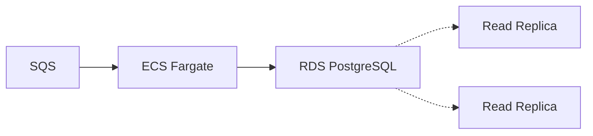
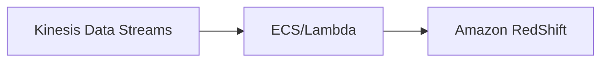

# Fetch Rewards Challenge

https://bitbucket.org/fetchrewards/data-engineering-take-home/src/master/

## A Python ETL app to persist messages from SQS

I chose Python to build this application because i'm very comfortable with it and is generally concise compared to other languages like C#.

## How to Execute

> **_NOTE:_**  Steps 1 - 3, 5 are copied over from take-home project

1. You will need the following installed on your local machine
    * make
        * Ubuntu -- `apt-get -y install make`
        * Windows -- `choco install make`
        * Mac -- `brew install make`
    * python3 -- [python install guide](https://www.python.org/downloads/)
    * pip3 -- `python -m ensurepip --upgrade` or run `make pip-install` in the project root
    * awslocal -- `pip install awscli-local`  or run `make pip install` in the project root
    * docker -- [docker install guide](https://docs.docker.com/get-docker/)
    * docker-compose -- [docker-compose install guide]()
2. Run `make start` to execute the docker-compose file in the the project
    * An AWS SQS Queue is created
    * A script is run to write 100 JSON records to the queue
    * A Postgres database will be stood up
    * A user_logins table will be created in the public schema
3. Test local access
    * Read a message from the queue using awslocal, `awslocal sqs receive-message --queue-url http://localhost:4566/000000000000/login-queue`
    * Connect to the Postgres database, verify the table is created
    * username = `postgres`
    * database = `postgres`
    * password = `postgres`
4. Change working directory to src
	* Install virtualenv `python3 -m pip install virtualenv`
	* Create virtualenv `python3 -m venv fetch_project`
	* Activate the virtualenv `source fetch_project/bin/activate`
	* Install all dependencies from requirements.txt file `pip install -r requirements.txt`
	* Execute script `python3 main.py`
	* Connect to Postgres database and verify table is populated
```bash
# password: postgres

psql -d postgres -U postgres  -p 5432 -h localhost -W
Password:
```
5. Run `make stop` to terminate the docker containers and optionally run `make clean` to clean up docker resources.

## Design choices:
### Extract:
Long-polling a batch of messages from SQS:
* Short polling will incur greater cost, higher network traffic and hog server resources.
* Using long polling with a time delay of 10s will cost less during off-peak periods.

This delay will depend on the operating scale and messages per batch.
### Transformations:
1. **app_version** - In raw JSON, the version number is of format Major.Minor.Patch (6.4.8). Since the target datatype is integer, I choose to extract only the Major version number from source.

2. **Masking** - Since requirements calls for masking `device_id` and `ip` - I choose to generate a SHA-256 hash with *SECRET_SALT*. With same *SECRET_SALT* used for all messages, output of SHA-256
is deterministic and is possible to identify duplicates for down-stream analytics.

3. **CreateDate** - Source doesn't contain an attribute called `create_date`. So default value is the date this message is read by ETL application.

### Loading:
Since I used long-polling and reading messages in batch - I used the `executemany` method to bulk-insert into user_logins tables to reduce the no. of database connections.


# Production Infrastructure build out:

#### 1 - 100 messages per second:
1. Package application as a docker container and deploy on AWS using ECS fargate. While EC2 with autoscaling group can be used, creating an EC2 instance from AMI is too heavy for this workload. 



### More than 1000 messages per second:

* This is *streaming data* territory


By using KMS we can control access to keys using Key policies and IAM roles to "a select few" who are responsible for down-stream analytics.

## Future Work:
**Masking and recovering PII**:
* Since hasing is irreversible, we could use symmetric key encryption to encrypt and later decrypt PII.

* This product will be hosted on AWS, so we can leverage AWS KMS service to create and securely store and access Symmetric keys.

**Telemetry:** By knowing the rate at which messages are arriving in Q, we could provision capacity ahead-of-time and reduce costs.

**Dead letter Queue:** At the moment, this application discards messages that couldn't be parsed. These could be retained for analysis downstream. Dirty data is still Data!!

**Exceptions and service availability issues:**
Although SQS and RDS have built-in high availability, automatic failover usually take couple seconds to minutes. Application needs to designed for graceful recovery.